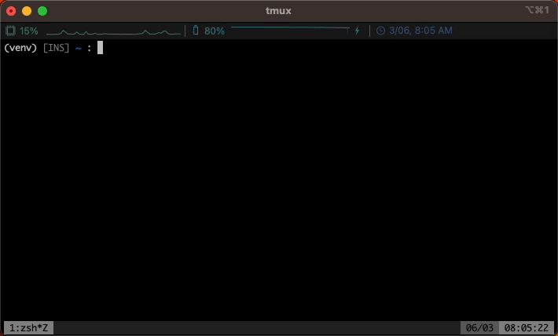

This is a TUI application for interacting with the openai chatGPT API.

# Install

 1. clone this repo
 2. Add a `secrets.yaml` file at the root level with you company id and api key
 3. `pip install -e .`
 4. You can now start the chat from any directory by typing the command `$ ai`

# Key Bindings

`esc` puts you into `vim` cmd mode. `i` or `a` puts you back into insert mode.
pressing `v` in cmd mode will open a vim editor so you and write multi-line prompts with full key bindings.

# Roadmap

 [x] Add `vim` key bindings to prompt input
 [x] Open `vim` for multi line prompts
 [ ] Support multi key vim keybindings. e.g. `dd` `ciw` 
 [ ] Initialize conversations from different common personas. e.g. travel agent
 [ ] Save conversations to a database
