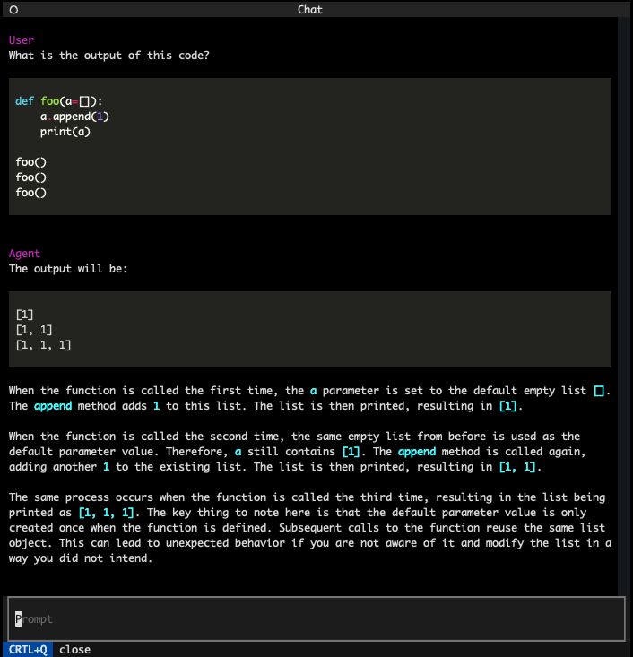

# ChatGPT TUI


[](https://github.com/bdhammel/chatgpt-tui/actions/workflows/python-publish.yml)


Terminal-based chat window with the chatGPT API




# Install

```
pip install aitui
```

## Development 
 1. clone this repo
 3. `pip install -e .`
 4. You can now start the chat from any directory by typing the command `$ ai`
 5. Upon startup, you will be asked for your OpenAI organization id and api-key
 
# Running the application

**Start up**

When the application starts up, it will ask you what agent you want to speak with.
You can save common persons with a preconditioned prompt here. e.g.:
 - Personal travel agent: A chat gpt assistant that recomends things to do within your interests
 - Python docstring writer
 - Personal car mechanic advisor
 - etc

**Key Bindings**

`esc` puts you into `vim` cmd mode. `i` or `a` puts you back into insert mode.
pressing `v` in cmd mode will open a vim editor so you and write multi-line prompts with full key bindings.

Note: There are some limitations with the vim key bindings. I've found I need to press `esc` twice or there is a long delay for entering into cmd mode. 

# Roadmap

 - [x] Add `vim` key bindings to prompt input
 - [x] Open `vim` for multi line prompts
 - [ ] Support multi key vim keybindings. e.g. `dd` `ciw` 
 - [x] Initialize conversations from different common personas. e.g. travel agent
 - [ ] Save conversations to a database
 - [ ] Output running cost of the conversation
 - [x] Publish to PyPi
 
 
# Credits

The TUI application is powered by [textualize](https://textual.textualize.io)  
OpenAI (of course)
